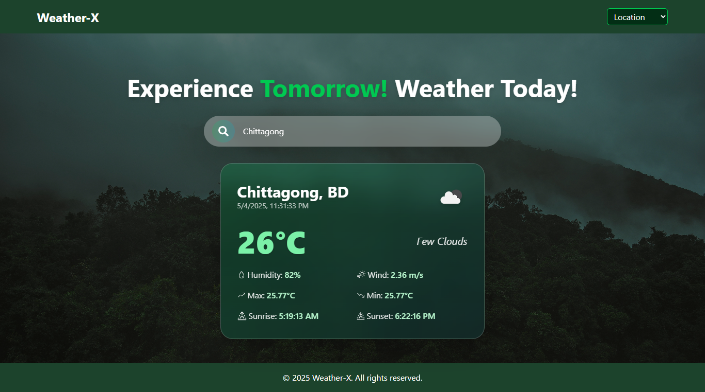

# Weather-X



## Description

Weather-X is a weather application that allows users to check weather information for various cities around the world. The app provides current weather data and dynamically updates based on user-selected or input locations.

----

## Frontend API

- **React**: The JavaScript library for building user interfaces.
- **Redux**: A state management library to handle global state.
- **React-Redux**: React bindings for Redux to integrate Redux state into React components.
- **Axios**: A promise-based HTTP client for making API requests.
- **React Icons**: A set of popular icons for React applications.
- **Tailwind CSS**: A utility-first CSS framework for rapid UI development.
- **Vite**: A fast build tool and development server for modern web projects.

## How to Install

1. **Clone the repository:**

   ```bash
   git clone https://github.com/Atef-Abrar-Bhuyian/Weather-X.git
   cd weather-x
   ```

2. **Install dependencies:**
   Make sure you have Node.js installed. Then run:

   ```bash
    npm install
   ```

3. **Set up environment variables:**
   Create a .env file in the root directory and add your OpenWeatherMap API key:

   ```bash
   VITE_OPENWEATHER_API=your_openweather_api_key
   ```

4. **Run the application:**
   ```bash
   npm run dev
   ```
